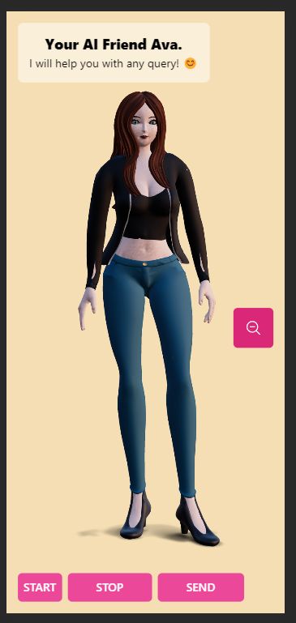

# ✨My-ai✨

A virtual ai chatbot friend that you chat with and it can answer your any query.
chatbot is conditioned to answer specificaly programing and coding related query.


## implementation
It's using React for the frontend with three.js to display character model.
Flask server is used to handle user's query and generate response.  
User's audio is first transcript using Whisper's fast-Whisper implementation with base model and then response is generated with Google's Gemini model,  we can use any open source model here with exposed api.  
The generated response is first converted with Tortoise TTS and then converting that audio to realistc voice using RVC , This is by far the best method that give most realistc sounding voice but with cost of time to do this heavy compute.

 


## Screenshots




## Run Locally

Clone the project

```bash
  git clone https://link-to-project
```

Go to the project directory

```bash
  cd my-project
```

Install dependencies abd run

```bash
  cd frontend
  npm install
  npm run dev
```

Start the server create new enviroment conda/virtualenv and run Tortoise tts webui in background

```bash
  pip install -r requirements.txt
  python app.py
```


## Features to add in future 😅

- Send audio data using websocket to client in real-time.
- Better voice quality and low latency.
- Implementing RAG so chatbot can answer more things.
- Frontend character's animation and logic.

